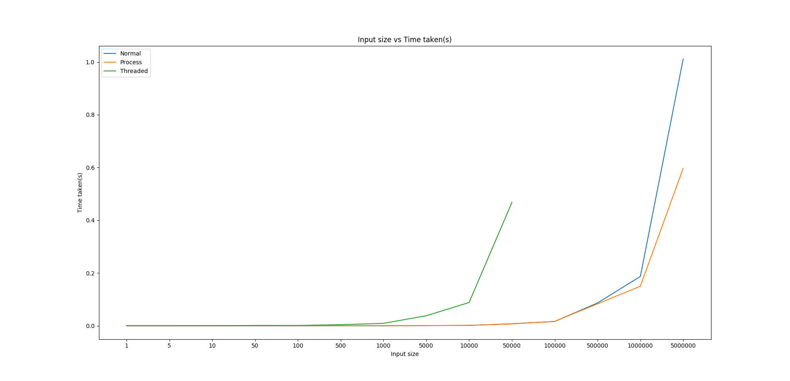

# Concurrent Quicksort

## Implementation
The place where this algorithm can be parallelized is the recursive call
which happens in two independent different parts of the array
[left of pivot and right of pivot].

I parallelize it in two ways:
 - creating new processes
 - creating new threads

If new processes are created, we need to share the memory [the array]
among all processes, so a shared memory region is created.

### NOTE
Having a large number of threads under a single process is bad.
If I try to sort 10000 numbers using threads, a lot of threads get
created and the cpu is overloaded. So, I have kept a cap of 50000
numbers to call the threaded sorting function

## Code snippets

```c
int p = partition(arr, l, r);
```

Normal:
```c
quickSort(arr, l, p - 1);
quickSort(arr, p + 1, r);
```

New processes:
```c
int p1 = fork();
int p2;

if(p1 == 0) {
    quickSort(arr, l, p - 1);
    exit(0);
} else {
    p2 = fork();
    if(p2 == 0) {
        quickSort(arr, p + 1, r);
        exit(0);
    } else {
        waitpid(p1, 0, 0);
        waitpid(p2, 0, 0);
    }
}
```

Threaded:
```c
a1.arr = a2.arr = a->arr;

a1.l = a->l;
a1.r = p - 1;

a2.l = p + 1;
a2.r = a->r;

pthread_t t1, t2;
pthread_create(&t1, 0, quickSortThread, &a1);
pthread_create(&t2, 0, quickSortThread, &a2);

pthread_join(t1, 0);
pthread_join(t2, 0);
```

## Results
*A picture speaks a thousand words*



Clearly, it is seen that at first, the parallelizing with process
approach is slower than doing the whole thing in a single process,
but, as we increase the length of the list, we see that process
starts outperforming the single process ones. This starts happening
from n = 5\*10^5

At n = 5\*10^6, process takes almost half the time compared to normal
